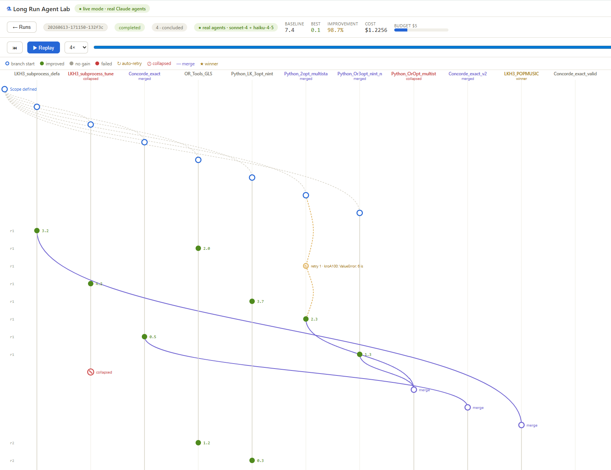
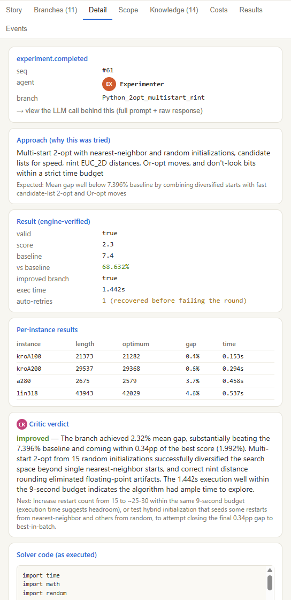
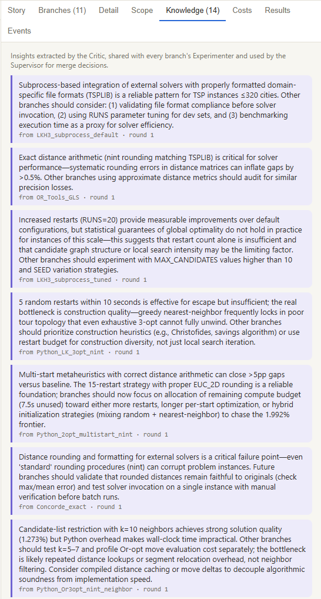
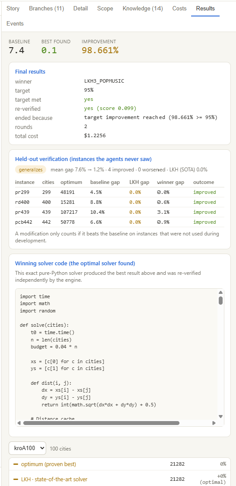

# ⚗ Long Run Agent Lab

**A laboratory where autonomous agents do real algorithmic research — over long horizons, under a budget, and against a baseline that cannot be fooled.**



Give the lab a problem and a budget. A team of agents defines the scope, proposes
competing hypotheses, and spins each one into its own experiment branch. Every branch
writes real code, runs it, and is **scored by the engine — never by the agent that wrote
it**. Weak branches collapse with evidence. Complementary ones merge. Discoveries from
one branch flow into the prompts of all the others. The run keeps going, round after
round, until it hits its target or runs out of money — and the whole thing is observable,
replayable, and independently re-verified at the end.

The first problem is the **Travelling Salesman Problem**, but TSP is just the proving
ground. The engine is problem-agnostic: anything with a verifiable score and a baseline
can become the next benchmark. The real artifact is the **research loop** — a system that
lets agents explore an algorithmic search space autonomously, leave behind a paper trail
of *why* each idea worked or didn't, and converge on a solution you can trust because the
lab proved it on instances the agents never saw.

In the run above: 11 branches, a $5 budget, **98.7% improvement over baseline** for
$1.23 — and the winner verified to generalize on held-out instances.

---

## Why this is interesting

Most "agent" demos are a single model talking to itself. This is different:

- **The agents compete and cooperate.** Branches race in parallel, but a shared
  knowledge base means a failure in one branch becomes a lesson for all of them.
- **Nothing is taken on trust.** Solver code runs in a subprocess; the engine validates
  and scores the result. The winner is re-verified — and then re-tested on a held-out set
  to expose anything that only worked because it overfit the dev instances.
- **It's budget-aware and long-running.** Every LLM call is priced in tokens and USD and
  attributed to an agent and a branch. The run manages its own compute and stops
  gracefully when the money runs out.
- **Every decision is auditable.** The entire run is an event stream — live view and
  replay are the same pure reduction of it. You can scrub back to event 0 and watch the
  research happen.

---

## A look inside a run

**Every experiment is fully traceable** — the approach tried, the engine-verified result,
the critic's verdict, and the exact code that produced it:



**Discoveries compound.** The Critic distills each result into a transferable insight that
is shared with every branch's Experimenter and used by the Supervisor for merge decisions:



**The result is proven, not claimed.** The winning solver is re-verified independently and
re-tested on instances the agents never saw during development — a modification only counts
if it beats the baseline on held-out data:



---

## Quick start

### 1. Backend (Python 3.10+)

```bash
cd backend
python -m venv .venv
.venv\Scripts\activate          # Windows  (source .venv/bin/activate on mac/linux)
pip install -r requirements.txt
copy .env.example .env          # optional: add your ANTHROPIC_API_KEY
uvicorn app.main:app --port 8000
```

- **No API key?** The lab runs in **mock mode**: agent reasoning is scripted along the
  canonical demo arc, but all solver code is *really executed and really scored* —
  results stay objective. Perfect for a free 5-minute demo.
- **With `ANTHROPIC_API_KEY`** in `backend/.env`: the five agents (Planner, Strategist,
  Experimenter, Critic, Supervisor) run on real models. Default budget: $2/run.

### 2. Frontend

```bash
cd frontend
npm install
npm run dev
```

Open http://localhost:5173, click **Start run**, and watch live. When it finishes,
press **▶ Replay** to scrub through the whole run from event 0.

## The 5-minute demo

1. **Start a run** — the Planner defines scope: objective, baseline score, target
   improvement, constraints, stop conditions (Scope tab).
2. **Hypotheses branch** — the Strategist proposes distinct strategies; each becomes
   a lane in the branch graph.
3. **Experiments run** — green nodes improved, gray didn't, red failed. Click any node
   to see the approach, the engine-verified result, the critic's verdict, and the exact
   code that was executed.
4. **A weak branch collapses** (⊘) — with the supervisor's evidence-based reason.
5. **Insights accumulate** (Knowledge tab) and flow into every branch's prompts.
6. **Two branches merge** (purple edges) into a combined hypothesis.
7. **The merged branch wins** (★) — Results tab shows baseline vs best tour drawn on
   canvas, improvement %, target met, and an independent re-verification of the score.
8. **Costs** tab: spend per agent, per branch, against budget. **Replay** to relive it.

## How it works

```
run starts
  └─ Planner  ──► scope.defined (objective, baseline, success criteria, stop conditions)
  └─ Strategist ─► N hypotheses ──► N branches
  └─ per round, per active branch:
        Experimenter ─► solver code ─► sandboxed execution ─► engine validates + scores
        Critic ─► verdict + transferable insight ─► shared knowledge base
     Supervisor ─► collapse weak / merge complementary / continue
  └─ stop condition fires ─► winner verified ─► run.completed
```

- **Event-sourced**: every action is an event in `backend/data/runs/<id>/events.jsonl`.
  Live view and replay are the same pure reduction of that stream.
- **Objective evaluation**: agent code runs in a subprocess with a timeout; the engine
  (never the agent) validates the solution and computes the score. The winner is
  re-verified at the end.
- **Cost-aware**: every LLM call emits tokens + USD, attributed to agent and branch.
  The run stops gracefully when the budget is hit.

See [docs/ARCHITECTURE.md](docs/ARCHITECTURE.md) for the full design and event schema.

## Configuration

Per run (UI or `POST /api/runs`): `n_cities`, `seed`, `num_hypotheses`, `max_rounds`,
`budget_usd`. Defaults in `backend/app/config.py`, models per agent role in
`backend/.env` (`MODEL_PLANNER`, `MODEL_EXPERIMENTER`, …). Pricing table in
`config.py` — keep it in sync with current pricing.

## ⚠ Security note

Experimenter agents write Python that is executed on your machine (subprocess +
timeout — process isolation, **not** a security sandbox). Run it locally for research,
inspect generated code in the UI, and don't expose the backend publicly.

## TSPLIB benchmark mode

Select **TSPLIB benchmark** in the new-run form (problem `tsp_benchmark`) to run
against real TSPLIB95 instances with known optima (files in `backend/data/tsplib/`):

- **Score = mean gap %** above the known optimum across the dev instances
  (TSPLIB rounded-integer metric), so 0 means optimal on every instance.
- **Strong baseline**: nearest-neighbor + 2-opt to local optimum (~6.5% mean gap),
  so agents must invent something beyond plain 2-opt.
- **Held-out verification**: when the run ends, the winning solver code is
  re-executed on instances the agents never saw. The Results tab reports
  per-instance gaps, improved/worsened counts, and a generalizes / does-not-generalize
  verdict — improvements that only work on the dev set are exposed.

Dev and held-out sets are configurable per run; defaults in
`backend/app/problems/tsp.py` (`DEFAULT_DEV`, `DEFAULT_HOLDOUT`).

## Adding a new problem

Implement `Problem` (`generate_instance`, `baseline`, `validate`, `evaluate`,
`instance_stats`, `solver_contract`) in `backend/app/problems/`, register it in
`PROBLEMS`. The engine, agents, UI graph, replay, and cost tracking all come for free;
only the result visualization (e.g. `TourCanvas`) is TSP-specific.
