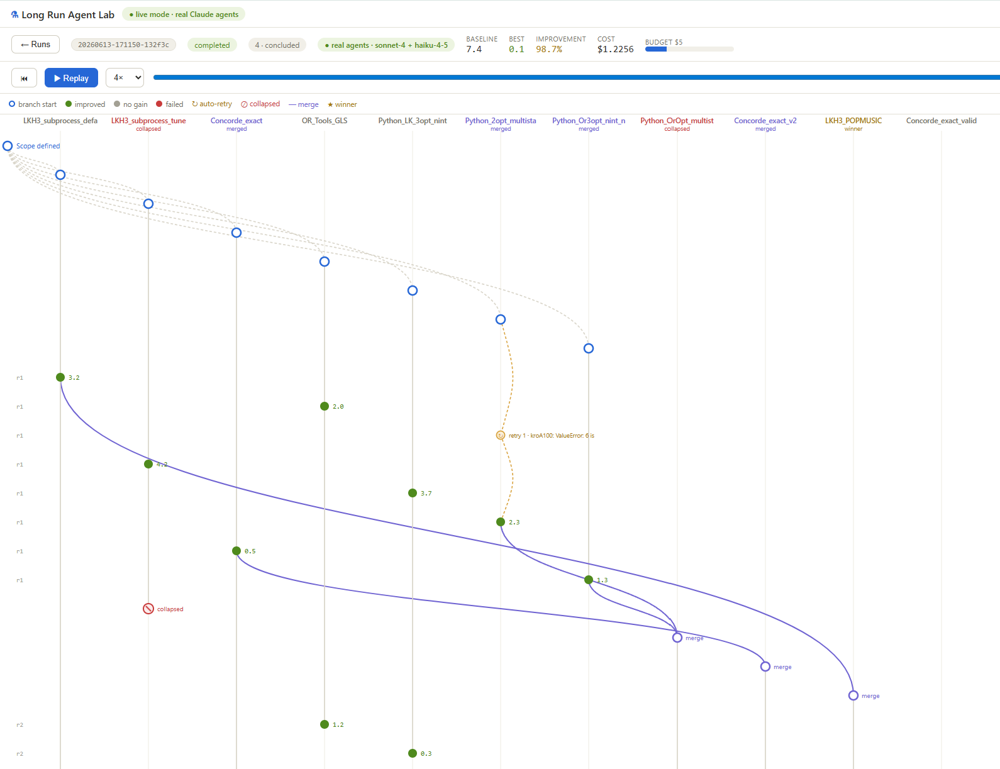
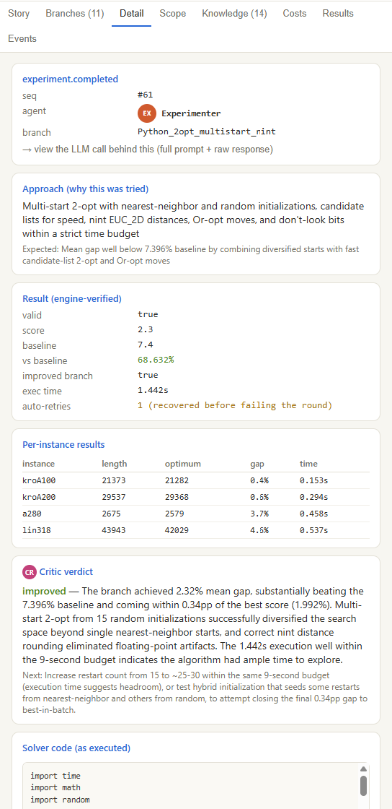
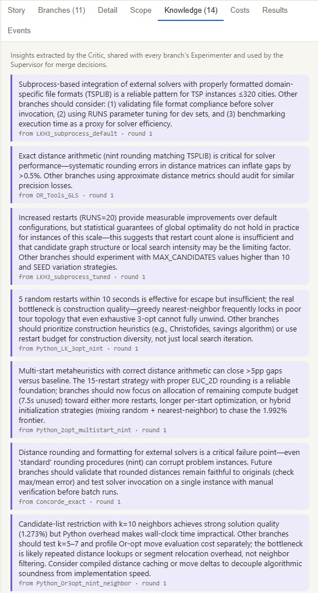
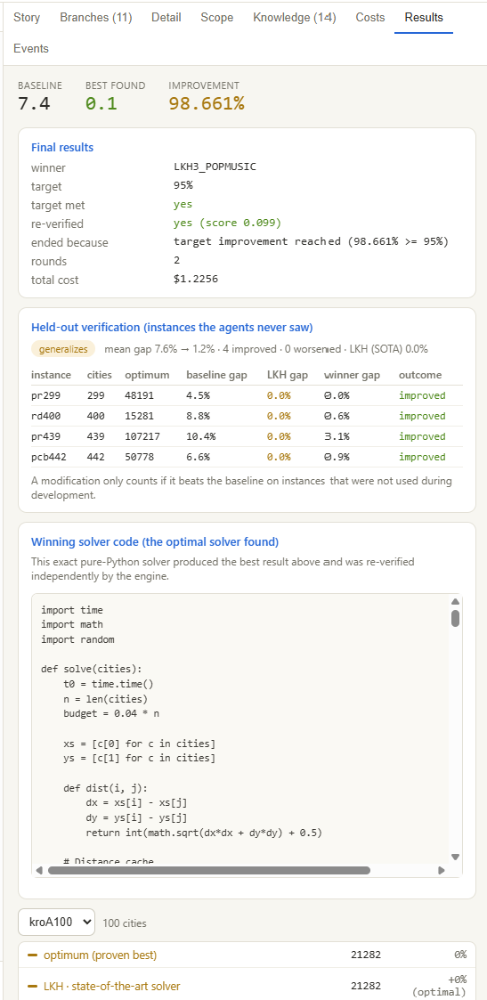

# ⚗ Long Run Agent Lab

**A laboratory where autonomous agents do real algorithmic research — over long horizons, under a budget, and against a baseline that cannot be fooled.**



Give the lab a problem and a budget. A team of agents defines the scope, proposes
competing hypotheses, and spins each one into its own experiment branch. Every branch
writes real code, runs it, and is **scored by the engine — never by the agent that wrote
it**. Weak branches collapse with evidence. Complementary ones merge. Discoveries from
one branch flow into the prompts of all the others. The run keeps going, round after
round, until it hits its target or runs out of money — and the whole thing is observable,
replayable, and independently re-verified at the end.

The current problem is **GPU kernel optimization** on the
[GPU MODE reference-kernels](https://github.com/gpu-mode/reference-kernels) benchmark:
agents write `submission.py`, and the **official upstream harness** — vendored
unmodified — checks their output against the reference on every test shape and only then
times it. Correctness is a hard gate; among correct kernels, the objective is runtime.
The engine is problem-agnostic, so anything with a verifiable score and a baseline can
become the next benchmark. The real artifact is the **research loop** — a system that
lets agents explore an optimization space autonomously, leave behind a paper trail of
*why* each idea worked or didn't, and converge on a result you can trust because the lab
proved it on shapes the agents never tuned against.

Rediscovering known techniques is **exactly the point** here: tiling, shared memory,
vectorised loads, coalescing, warp-level primitives, fusion, launch configuration,
tensor cores, shape specialisation. This lab measures speedup, not novelty.

---

## Why this is interesting

Most "agent" demos are a single model talking to itself. This is different:

- **The agents compete and cooperate.** Branches race in parallel, but a shared
  knowledge base means a failure in one branch becomes a lesson for all of them.
- **Nothing is taken on trust.** Every kernel is run by the official GPU MODE harness,
  which checks it against the reference before timing it. The winner is then re-timed on
  held-out shapes, to expose anything that only worked on the shapes it was tuned for.
- **It's budget-aware and long-running.** Every LLM call is priced in tokens and USD and
  attributed to an agent and a branch. The run manages its own compute and stops
  gracefully when the money runs out.
- **Every decision is auditable.** The entire run is an event stream — live view and
  replay are the same pure reduction of it. You can scrub back to event 0 and watch the
  research happen.

---

## A look inside a run

**Every experiment is fully traceable** — the approach tried, the engine-verified result,
the critic's verdict, and the exact code that produced it:



**Discoveries compound.** The Critic distills each result into a transferable insight that
is shared with every branch's Experimenter and used by the Supervisor for merge decisions:



**The result is proven, not claimed.** The winning kernel is re-timed on benchmark shapes
the agents never developed against — a kernel only counts if it also beats the reference
on held-out shapes:



---

## Quick start

### 1. Backend (Python 3.10+)

```bash
cd backend
python -m venv .venv
.venv\Scripts\activate          # Windows  (source .venv/bin/activate on mac/linux)
pip install -r requirements.txt
copy .env.example .env          # optional: add your ANTHROPIC_API_KEY
uvicorn app.main:app --port 8000
```

- **No API key?** The lab runs in **mock mode**: agent reasoning is scripted along the
  canonical demo arc, but every kernel is *really executed by the official harness, really
  checked for correctness and really timed* — the mock cannot invent a speedup. Perfect
  for a free 5-minute demo.
- **No NVIDIA GPU?** The `local` backend still runs the real harness on CPU: correctness
  is real, timings are CPU timings. Point the run at the `modal` backend for numbers that
  mean something. See [The kernel benchmark](#the-kernel-benchmark).
- **With `ANTHROPIC_API_KEY`** in `backend/.env`: the five agents (Planner, Strategist,
  Experimenter, Critic, Supervisor) run on real models. Default budget: $2/run.

### 2. Frontend

```bash
cd frontend
npm install
npm run dev
```

Open http://localhost:5173, click **Start run**, and watch live. When it finishes,
press **▶ Replay** to scrub through the whole run from event 0.

## The 5-minute demo

1. **Start a run** — the Planner defines scope: objective, baseline score, target
   improvement, constraints, stop conditions (Scope tab).
2. **Hypotheses branch** — the Strategist proposes distinct strategies; each becomes
   a lane in the branch graph.
3. **Experiments run** — green nodes improved, gray didn't, red failed. Click any node
   to see the approach, the engine-verified result, the critic's verdict, and the exact
   code that was executed.
4. **A weak branch collapses** (⊘) — with the supervisor's evidence-based reason.
5. **Insights accumulate** (Knowledge tab) and flow into every branch's prompts.
6. **Two branches merge** (purple edges) into a combined hypothesis.
7. **The merged branch wins** (★) — Results tab shows the reference vs best runtime,
   the aggregate speedup, target met, per-shape benchmarks, and the held-out re-timing.
8. **Costs** tab: spend per agent, per branch, against budget. **Replay** to relive it.

## How it works

```
run starts
  └─ Planner  ──► scope.defined (objective, baseline, success criteria, stop conditions)
  └─ Strategist ─► N hypotheses ──► N branches
  └─ per round, per active branch:
        Experimenter ─► submission.py ─► official harness: correctness gate, then timing
        Critic ─► verdict + transferable insight ─► shared knowledge base
     Supervisor ─► collapse weak / merge complementary / continue
  └─ stop condition fires ─► winner verified ─► run.completed
```

- **Event-sourced**: every action is an event in `backend/data/runs/<id>/events.jsonl`.
  Live view and replay are the same pure reduction of that stream.
- **Objective evaluation**: the official upstream harness runs the agent's kernel — a
  wrong result is rejected before it is ever timed — and the engine (never the agent)
  aggregates the per-shape measurements into the score.
- **Cost-aware**: every LLM call emits tokens + USD, attributed to agent and branch.
  The run stops gracefully when the budget is hit.

See [docs/ARCHITECTURE.md](docs/ARCHITECTURE.md) for the full design and event schema.

## The evolution substrate

Refinement alone plateaus: branches converge on the same well-known heuristics and
stop producing anything new. The lab therefore runs the search as an **open evolving
population over a real git DAG**, borrowing the mechanisms behind AlphaEvolve,
ShinkaEvolve, the Darwin Gödel Machine, EvoGit and ReEvo:

- **Git is the backbone** (`app/gitrepo.py`). Each run owns a real git repository at
  `backend/data/runs/<id>/repo`. Every kernel attempt is a commit (`solver.py` +
  `meta.json` with the harness-measured score); every hypothesis is a git branch; a
  supervisor merge is a true two-parent merge commit. `git log --graph` of that repo
  *is* the run's lineage — shown in the Evolution tab.
- **Any program can be a parent** (`app/population.py`). Darwin-Gödel-Machine rule:
  each mutation's parent is sampled from the whole population — dead branches and past
  runs' winners included — with probability ∝ quality × 1/(1 + children). Strong but
  unexplored lineages get their shot; cross-lineage parents show up as merge commits.
- **Elites are kept per behavior niche, not one global best** (MAP-Elites). Programs
  are binned by *how* they win (`small_speedup`, `large_speedup`, `scaling` — see
  `Problem.behavior_descriptor`), so a kernel that is fast on small shapes and one that
  is fast on large shapes occupy different niches and both survive, even when their
  aggregate scores match.
- **The duplicate gate is available but OFF by default** (`app/novelty.py`). It
  fingerprints candidates on canonicalized AST n-grams and can bounce a near-copy back
  before it costs anything. For kernels it ships disabled: re-deriving a standard
  optimisation is a perfectly good outcome, and the lab should not push agents away from
  techniques that work. Switch `enable_novelty_gate` on if you want it purely as a
  don't-pay-twice guard against re-evaluating an identical kernel.
- **Crossover is informed, not silent**. A merged branch's first experiment sees BOTH
  parents' code plus the supervisor's reflection on why the combination should win
  (ReEvo-style verbal gradient), under a forced `recombine` operator.
- **A UCB1 bandit learns which mutation pays off** (`app/bandit.py`). Operators —
  `refine`, `rewrite`, `recombine`, `explore` (attack a different bottleneck) — are
  rewarded for improvement *and* for opening new niches, discounted
  by cost. Offer several experimenter models via `MODELS_EXPERIMENTER` in `.env` and
  the bandit arbitrates those too.
- **Prompts show diverse inspiration**: elites from *different* niches plus one
  deliberately odd non-elite, because diverse context is the strongest known lever on
  diverse output.

Everything is per-run configurable in `backend/app/config.py` (`enable_git_repo`,
`enable_novelty_gate`, `population_parent_prob`, `inspiration_count`,
`enable_operator_bandit`) and works identically in mock mode. The **Evolution tab**
shows it all live: the git DAG, the niche-elite table, and what the bandit learned.

## Configuration

Per run (UI or `POST /api/runs`): `problem_params.kernel_problem`,
`problem_params.backend`, `problem_params.gpu`, `num_hypotheses`, `max_rounds`,
`budget_usd`. Defaults in `backend/app/config.py`, models per agent role in
`backend/.env` (`MODEL_PLANNER`, `MODEL_EXPERIMENTER`, …). Pricing table in
`config.py` — keep it in sync with current pricing.

## ⚠ Security note

Experimenter agents write Python that the `local` backend executes on your machine
(subprocess + timeout — process isolation, **not** a security sandbox), and kernels may
compile inline CUDA. Run it locally for research, inspect generated code in the UI, and
don't expose the backend publicly. The `modal` backend runs the same code in a
disposable remote container instead.

## The kernel benchmark

Problems are vendored under `backend/data/kernels/<problem>/` straight from
[gpu-mode/reference-kernels](https://github.com/gpu-mode/reference-kernels) — `task.yml`,
`task.py`, `reference.py`, `submission.py`, plus the shared `eval.py` / `utils.py`. The
lab does not modify them, so a score here means what it means upstream.

- **Score = geometric mean of the per-shape mean runtimes (ns)**, lower is better — so
  the engine's improvement figure reads directly as the aggregate speedup over the
  reference kernel.
- **Correctness is a hard gate.** Every submission runs `test` mode first (all official
  test shapes); only if it passes does it get timed. A fast wrong kernel scores nothing.
- **Per-shape results are stored**, not just the aggregate: mean/best/worst/runs and the
  speedup vs the reference for each benchmark shape, on every `experiment.completed`.
- **Held-out shapes** are kept aside for the end. The winner is re-timed on them against
  the reference; a kernel tuned only to the shapes it saw gets exposed there.

### Which problem to pick

| problem | tolerance | notes |
|---|---|---|
| `grayscale_py` *(default)* | rtol/atol `1e-4`, fp32 | The reference materialises a full-size temporary, so there is real headroom. Cheap enough for the CPU backend. |
| `conv2d_py` | rtol/atol `1e-3`, fp32 | Loosest tolerance and the most optimization headroom, but far too heavy for CPU — use Modal. |
| `matmul_py` | rtol `1e-5`, **fp16** | ⚠ **Not recommended.** The tolerance is ~100x tighter than a single fp16 ULP, so only a bit-identical accumulation order passes. Even computing in fp32 — which is *more* accurate than the reference — fails. It cannot reward optimization. |

### Execution backends

`backend/app/kernels/runner.py` assembles the same working directory and parses the same
harness output for both backends, so they are interchangeable:

| backend | correctness | timings | setup |
|---|---|---|---|
| `local` | real | real, but **CPU timings** unless this machine has CUDA | none |
| `modal` | real | real GPU (T4 / L4 / A100 / H100) | see below |

```bash
pip install modal
modal token new                                     # opens a browser to authenticate
modal deploy backend/app/kernels/modal_app.py       # one-off; builds the image
modal run backend/app/kernels/modal_app.py          # smoke test: prints the GPU it got
```

`L4` is the default: modern, cheap per second, and ample for the pmpp shapes.
The image is pinned and cached by Modal, and a warm container is kept between
experiments (`scaledown_window`), so a run's dozens of evaluations pay the CUDA
and torch import once rather than every call. Every remote result carries the
GPU it actually ran on, its exit code, and its stderr.

On a machine without CUDA the local backend rewrites `device='cuda'` in `reference.py`
and no-ops `torch.cuda.synchronize` through an injected `sitecustomize.py`. That is the
only source rewriting that ever happens, and every result is tagged with the backend it
came from, so CPU numbers are never mistaken for GPU numbers.

### Results are only comparable within their domain

A runtime means nothing on its own: a 4&times; on grayscale/CPU and a 4&times; on
conv2d/A100 are different facts. Every run computes an **evaluation domain** —
benchmark, backend, hardware, and whether the reasoning was scripted — and the
cross-run archive is scoped to it. A CPU smoke test cannot seed a GPU search, a
different GPU cannot set its expectations, and a mock run's numbers never reach a
real one (`archive_include_mock` is off). Every archive entry records its run id,
domain and provenance.

This is not hypothetical: a real run once read a scripted demo's 90.6% out of lab
memory, concluded further gains were unlikely, set itself a 15% target against a
configured 90%, and stopped after one round.

### The run's objective is the operator's, not the Planner's

`target_improvement_pct` in config is authoritative. The Planner still proposes a
target and uses it to steer strategy, but it can only ever **raise** the bar, never
lower it. `min_rounds` (default 3) additionally prevents the target from ending a
supposedly long-running experiment in its first round.

### Validating against the official leaderboard

`popcorn-cli` is deliberately kept **out of the experiment loop** — its queue latency and
rate limits would throttle a loop that runs dozens of evaluations. Use it to check a
finished winner:

```bash
python -m app.scripts.popcorn_submit <run_id> --leaderboard grayscale_v2 --gpu A100 --yes
```

Without `--yes` it is a dry run, because a leaderboard submission is public.

## Tests

```bash
cd backend
pip install pytest
pytest tests -m "not slow"    # ~8s, no GPU and no API key needed
pytest tests                  # adds the real-harness integration tests (~2 min)
```

The fast tests cover the pure logic the whole system rests on: the harness
output parser, the case-file grammar, collision-free shape labelling, the
geometric-mean score, the correctness gate, the dev/holdout split, the
behaviour descriptor, MAP-Elites niching, DGM parent selection, the operator
bandit, the AST fingerprint and the git DAG. The `slow` ones shell out to the
real GPU MODE harness and assert that a fused kernel genuinely beats the
reference and that a wrong one is rejected before it is ever timed.

Two of these exist because the bugs happened: `test_budget_guard.py` replays
the researcher turn that reached 1.5M input tokens and $4.66 on a $2 budget,
and `test_harness_io.py` pins the shape labels that used to collide on
conv2d_py and silently drop a measurement from the score.

## Adding a new problem

Two levels:

- **Another reference-kernel**: drop its upstream files into
  `backend/data/kernels/<name>/` and select it in the UI — no code changes.
- **Another domain**: implement `Problem` (`generate_instance`, `baseline`, `validate`,
  `evaluate`, `instance_stats`, `solver_contract`, `execute`, optionally `holdout_eval`
  and `behavior_descriptor`) in `backend/app/problems/` and register it in `PROBLEMS`.
  The engine, agents, git DAG, population, UI graph, replay and cost tracking all come
  for free. If your descriptor uses new axes, add them to `_NICHE_AXES` in
  `app/population.py`.
